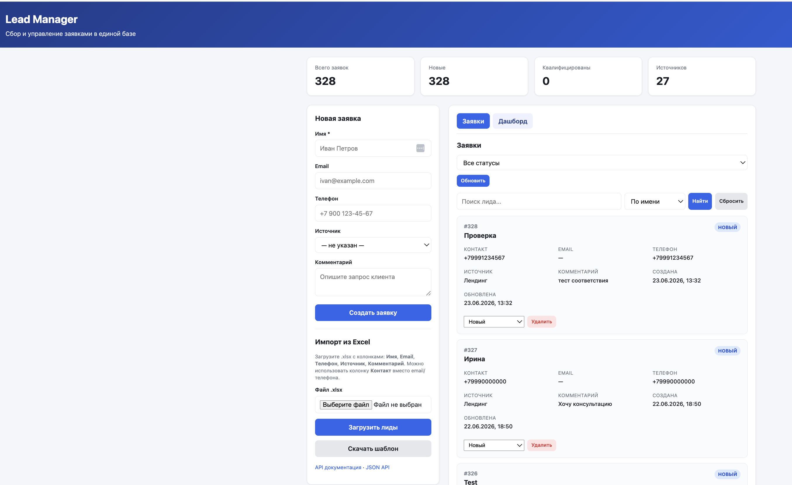
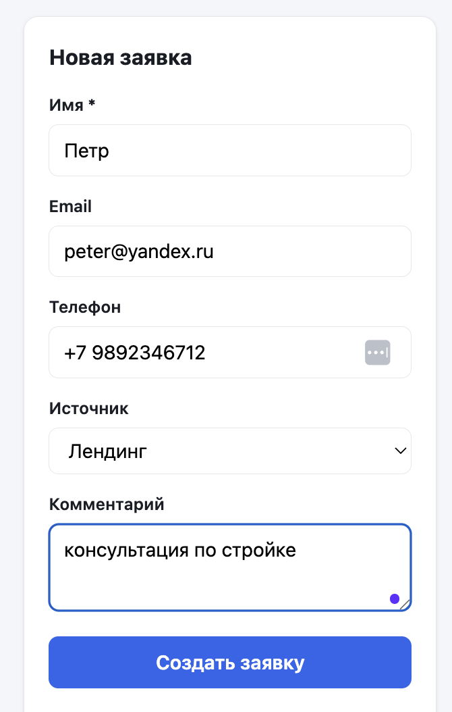
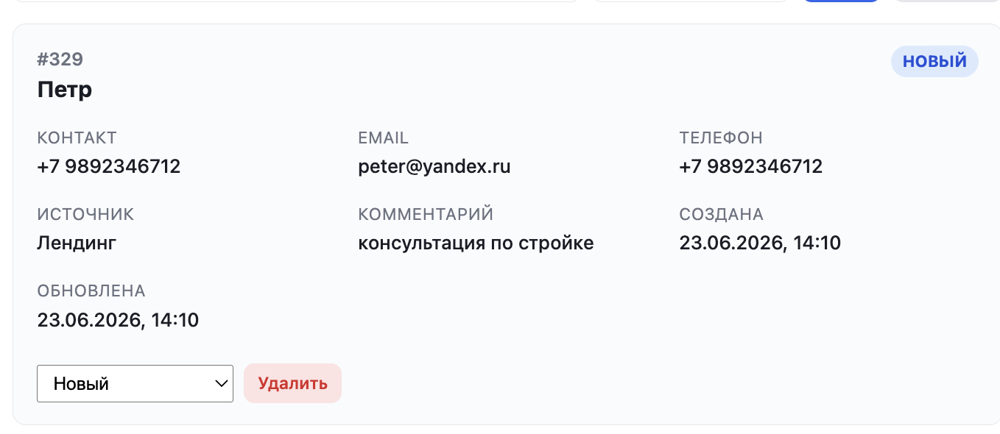
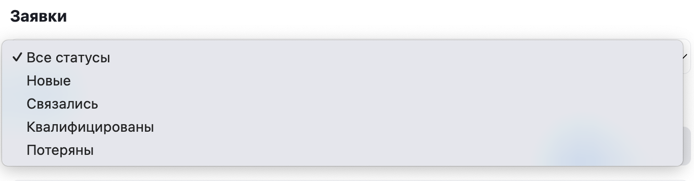
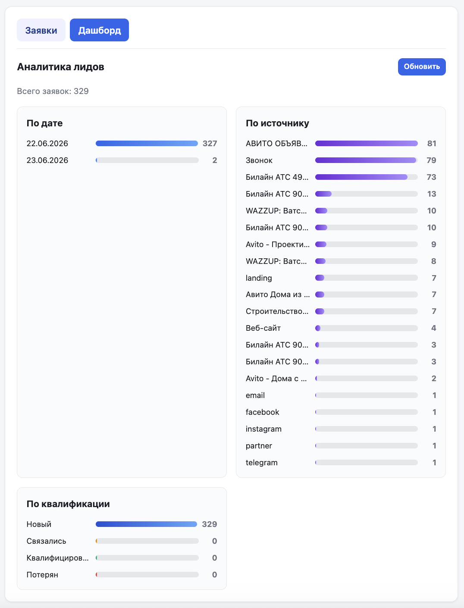

# Lead Manager

Сервис сбора и учёта заявок для малого бизнеса: **сайт или форма → проверка данных → база → уведомление менеджеру**.

Заявки из лендинга, мессенджеров и таблиц попадают в единую базу — менеджер сразу видит новое обращение и может вести клиента по воронке продаж.

---

## Скриншоты интерфейса

### Панель менеджера

Единый экран: метрики, список заявок, создание вручную и импорт из Excel.



### Создание заявки и карточка клиента

| Новая заявка | Карточка в списке |
|--------------|-------------------|
|  |  |

### Импорт из Excel и Bitrix24

Загрузка `.xlsx` — в том числе выгрузки из Bitrix24 CRM.


### Поиск и фильтрация

| Поиск по имени, телефону, источнику | Фильтр по статусу воронки |
|-------------------------------------|---------------------------|
|  |  |

### Аналитика

Дашборд: заявки по дате, источнику и квалификации.



---

## Ключевые возможности

| Функция | Описание |
|---------|----------|
| Приём заявок с сайта | Webhook `POST /lead` — JSON с именем, контактом, источником и комментарием |
| Единая база обращений | SQLite: все каналы в одной таблице `leads` |
| Уведомление о новой заявке | Запись в журнал `logs/events.log` при каждом сохранении |
| Контроль входящих данных | Проверка JSON и обязательных полей, понятные ответы API |
| Отказоустойчивость | Ошибки базы фиксируются в логе, клиент получает корректный HTTP-ответ |

---

## Как это работает

```
Лендинг / форма / curl
        │
        ▼
   POST /lead  (JSON)
        │
        ▼
   Валидация (Pydantic)
        │
        ▼
   SQLite (data/leads.db)
        │
        ▼
   logs/events.log  →  "New lead saved: 42"
        │
        ▼
   HTTP 201 + JSON с id заявки
```

---

## Быстрый старт

### Требования

- Python 3.10+
- pip

### Установка и запуск

```bash
git clone https://github.com/PavelKoff2025/Leads_Manager.git
cd Leads_Manager

python3 -m venv venv
source venv/bin/activate      # Linux / macOS
# venv\Scripts\activate       # Windows

pip install -r requirements.txt
python run.py
```

Сервис доступен на:

| URL | Назначение |
|-----|------------|
| http://localhost:8000/ | Веб-интерфейс |
| http://localhost:8000/docs | Swagger UI |
| http://localhost:8000/health | Проверка состояния |

Альтернативный запуск:

```bash
uvicorn app.main:app --reload --host 0.0.0.0 --port 8000
```

### Проверка за 5 минут (после запуска)

В **новом терминале** (сервер должен работать в первом):

```bash
# 1. Отправить заявку
curl -X POST http://localhost:8000/lead \
  -H "Content-Type: application/json" \
  -d '{"name":"Ирина","contact":"+79990000000","source":"landing","comment":"Тест"}'

# 2. Посмотреть запись в SQLite (подставьте id из ответа curl)
sqlite3 data/leads.db "SELECT id, name, contact, source, comment FROM leads ORDER BY id DESC LIMIT 5;"

# 3. Посмотреть уведомление в логе
tail -5 logs/events.log
```

В логе должна появиться строка `New lead saved: <id>`. Заявку также можно увидеть в веб-интерфейсе: http://localhost:8000/

---

## Приём заявок — `POST /lead`

### Формат запроса

```json
{
  "name": "Ирина",
  "contact": "+79990000000",
  "source": "landing",
  "comment": "Хочу консультацию по тарифам"
}
```

| Поле | Обязательное | Описание |
|------|--------------|----------|
| `name` | да | Имя клиента |
| `contact` | да | Телефон или email |
| `source` | нет | Канал: `landing`, `telegram`, `instagram` и т.д. |
| `comment` | нет | Комментарий к заявке |

### Пример (curl)

```bash
curl -X POST http://localhost:8000/lead \
  -H "Content-Type: application/json" \
  -d '{
    "name": "Ирина",
    "contact": "+79990000000",
    "source": "landing",
    "comment": "Хочу консультацию по тарифам"
  }'
```

### Успешный ответ — HTTP 201

```json
{
  "id": 1,
  "name": "Ирина",
  "contact": "+79990000000",
  "source": "landing",
  "comment": "Хочу консультацию по тарифам",
  "created_at": "2026-06-22T15:50:25.575555Z",
  "status": "new"
}
```

### Подключение с лендинга (JavaScript)

```javascript
fetch("http://localhost:8000/lead", {
  method: "POST",
  headers: { "Content-Type": "application/json" },
  body: JSON.stringify({
    name: document.getElementById("name").value,
    contact: document.getElementById("phone").value,
    source: "landing",
    comment: document.getElementById("message").value,
  }),
});
```

---

## База данных (SQLite)

Файл: `data/leads.db` (создаётся автоматически при первом запуске).

### Структура карточки заявки

| Поле | Тип | Описание |
|------|-----|----------|
| `id` | INTEGER | Первичный ключ, автоинкремент |
| `created_at` | TEXT | Дата и время создания (ISO UTC) |
| `name` | TEXT | Имя |
| `contact` | TEXT | Контакт (телефон или email) |
| `source` | TEXT | Источник заявки |
| `comment` | TEXT | Комментарий |

Дополнительные поля (`email`, `phone`, `status`, `notes`, `updated_at`) поддерживают воронку продаж, веб-панель и импорт из CRM.

### Как посмотреть данные

**Через терминал** (встроенная утилита `sqlite3`):

```bash
# Последние 5 заявок
sqlite3 data/leads.db "SELECT id, created_at, name, contact, source, comment FROM leads ORDER BY id DESC LIMIT 5;"

# Конкретная заявка по id
sqlite3 data/leads.db "SELECT * FROM leads WHERE id = 1;"
```

**Через GUI** — откройте файл `data/leads.db` в [DB Browser for SQLite](https://sqlitebrowser.org/) (вкладка *Browse Data* → таблица `leads`).

**Через веб-интерфейс** — http://localhost:8000/ (список заявок без установки доп. программ).

> Файл `data/leads.db` создаётся при первом запуске `python run.py`. В git он не попадает (см. `.gitignore`).

---

## Уведомления о новых заявках

При каждой новой заявке в `logs/events.log` пишется строка:

```
2026-06-22 18:50:25 | New lead saved: 1
```

Проверка:

```bash
tail -f logs/events.log
```

Дополнительно в консоль выводится форматированный блок с данными заявки.

---

## Обработка ошибок

Все ошибки возвращаются в формате `{"error": "..."}`.

| Ситуация | HTTP | Пример ответа |
|----------|------|---------------|
| Невалидный JSON | 400 | `{"error": "Невалидный JSON"}` |
| Отсутствует `contact` | 400 | `{"error": "Отсутствует или невалидное поле contact"}` |
| Ошибка SQLite | 500 | `{"error": "Database error"}` |
| Дубликат email (расширенный API) | 409 | `{"error": "Лид с таким email уже существует"}` |

Примеры проверки:

```bash
# Нет contact → 400
curl -s -X POST http://localhost:8000/lead \
  -H "Content-Type: application/json" \
  -d '{"name": "Тест"}'

# Невалидный JSON → 400
curl -s -X POST http://localhost:8000/lead \
  -H "Content-Type: application/json" \
  -d 'not json'
```

---

## Тестирование

Готовые payload-ы: `tests/test_payloads.json`.

### Пример приёма заявки

```bash
curl -s -X POST http://localhost:8000/lead \
  -H "Content-Type: application/json" \
  -d @- <<'EOF'
{
  "name": "Ирина",
  "contact": "+79990000000",
  "source": "landing",
  "comment": "Хочу консультацию по тарифам"
}
EOF
```

### Массовая загрузка тестовых лидов

```bash
for payload in $(jq -c '.create_leads[]' tests/test_payloads.json); do
  curl -s -X POST http://localhost:8000/leads \
    -H "Content-Type: application/json" \
    -d "$payload" | jq .
done
```

---

## Структура проекта

```
lead-manager/          # локальная папка проекта (в git — Leads_Manager)
├── app/
│   ├── main.py              # FastAPI: маршруты, обработка ошибок
│   ├── database.py          # SQLite: схема, CRUD, миграции
│   ├── models.py            # Pydantic-модели и валидация
│   ├── logger.py            # Логирование
│   ├── notifications.py     # Event log + уведомления
│   ├── importer.py          # Импорт из .xlsx
│   └── static/              # Веб-интерфейс (HTML, CSS, JS)
├── data/
│   └── leads.db             # SQLite (создаётся автоматически)
├── logs/
│   └── events.log           # Лог событий
├── tests/
│   └── test_payloads.json   # Тестовые запросы
├── run.py                   # Точка входа
├── requirements.txt
└── README.md
```

---

## Панель менеджера и интеграции

Инструменты для ежедневной работы с заявками после их поступления.

| Возможность | Endpoint / UI |
|-------------|---------------|
| Веб-панель менеджера | `GET /` |
| CRUD по лидам | `POST/GET/PATCH/DELETE /leads` |
| Поиск и фильтрация | `GET /leads?q=...&search_by=...&status=...` |
| Импорт Excel / Bitrix24 | `POST /leads/import` |
| Дашборд | `GET /api/dashboard` (вкладка «Дашборд» в UI) |
| Статусы воронки | `new` → `contacted` → `qualified` / `lost` |

### Импорт заявок из Excel (.xlsx)

Загрузка файла через веб-интерфейс (блок **«Импорт из Excel»**) или API:

```bash
curl -X POST http://localhost:8000/leads/import \
  -F "file=@leads.xlsx"
```

Шаблон для ручного заполнения: http://localhost:8000/leads/import/template

**Обычный формат** — первая строка заголовки, далее данные. Поддерживаются русские и английские названия колонок (распознавание по синонимам):

| Поле | Примеры заголовков |
|------|-------------------|
| Имя | `Имя`, `ФИО`, `Клиент`, `name` |
| Email | `Email`, `Почта`, `mail` |
| Телефон | `Телефон`, `Тел`, `phone` |
| Контакт | `Контакт`, `contact` |
| Источник | `Источник`, `Канал`, `source` |
| Комментарий | `Комментарий`, `Описание`, `notes` |

**Адаптация под Bitrix24** — при импорте выгрузки CRM сервис автоматически:

- определяет формат Bitrix по характерным колонкам (`Название лида`, `Рабочий телефон`, `Источник`);
- выбирает лист с наибольшим числом строк (удобно для файлов с десятками колонок);
- собирает **имя** из полей `Имя` + `Отчество` + `Фамилия` (или берёт `Название лида`);
- извлекает **телефон** из рабочего, мобильного, домашнего и других телефонных полей;
- извлекает **email** из рабочего, частного и прочих email-полей;
- формирует **комментарий** из `Комментарий`, `Обращение`, `Стадия`, `Дополнительно о стадии`;
- сохраняет **источник** из колонки `Источник`.

Ответ API: количество созданных и пропущенных записей, список ошибок по строкам.

### Поиск и фильтрация заявок

Доступно в веб-интерфейсе (строка поиска + выпадающий список) и через API `GET /leads`.

**Поиск по параметрам** (`?q=текст&search_by=...`):

| Параметр `search_by` | Что ищется |
|----------------------|------------|
| `name` | Имя клиента (по умолчанию) |
| `phone` | Телефон / контакт (`contact`) |
| `source` | Источник заявки (`landing`, `telegram`, `yandex` и т.д.) |

Поиск нечувствителен к регистру, работает по подстроке (`LIKE %...%`).

**Фильтр по статусу** — параметр `?status=new|contacted|qualified|lost` (в UI — выпадающий список «Все статусы / Новые / …»).

**Пагинация** — `?limit=100&offset=0` (максимум 500 за запрос).

Примеры:

```bash
# По имени
curl "http://localhost:8000/leads?q=Ирина&search_by=name"

# По телефону
curl "http://localhost:8000/leads?q=7999&search_by=phone"

# По источнику + только новые
curl "http://localhost:8000/leads?q=landing&search_by=source&status=new"
```

### Дашборд аналитики

Вкладка **«Дашборд»** в веб-интерфейсе или `GET /api/dashboard`.

Выводится:

- **Всего заявок** — общее количество лидов в базе;
- **По дате** — столбчатая диаграмма: сколько заявок пришло в каждый день (последние 30 дней);
- **По источнику** — распределение по каналам (`landing`, `telegram`, `instagram` и др.; пустые — «Не указан»), топ-20;
- **По квалификации** — разбивка по статусам воронки: *Новый*, *Связались*, *Квалифицирован*, *Потерян*.

Данные обновляются кнопкой «Обновить» или при переключении на вкладку.

```bash
curl http://localhost:8000/api/dashboard
```

Пример фрагмента ответа:

```json
{
  "total": 327,
  "by_date": [{"label": "22.06.2026", "count": 15}],
  "by_source": [{"label": "landing", "count": 120}],
  "by_status": [{"label": "Новый", "count": 280}]
}
```

---

## API (полный список)

| Метод | Endpoint | Описание |
|-------|----------|----------|
| GET | `/` | Веб-интерфейс |
| GET | `/api/info` | Информация о сервисе |
| GET | `/health` | Проверка состояния |
| **POST** | **`/lead`** | **Приём заявки с сайта (webhook)** |
| POST | `/leads` | Создание заявки (расширенный формат) |
| GET | `/leads` | Список лидов |
| GET | `/leads/{id}` | Получить лид |
| PATCH | `/leads/{id}` | Обновить лид |
| DELETE | `/leads/{id}` | Удалить лид |
| POST | `/leads/import` | Импорт из .xlsx |
| GET | `/leads/import/template` | Шаблон .xlsx |
| GET | `/api/dashboard` | Статистика по дате, источнику, статусу |

---

## Стек технологий

| Компонент | Версия / пакет | Назначение |
|-----------|----------------|------------|
| Python | 3.11+ | Язык разработки |
| FastAPI | 0.104.1 | HTTP API, маршруты, Swagger (`/docs`) |
| Pydantic | 2.5.0 | Валидация входящих данных |
| SQLite | 3.x (stdlib) | Хранение заявок в `data/leads.db` |
| Uvicorn | 0.24.0 | ASGI-сервер |
| openpyxl | 3.1.2 | Импорт заявок из `.xlsx` (в т.ч. Bitrix24) |
| python-multipart | 0.0.6 | Загрузка файлов через `POST /leads/import` |

Входящие заявки проходят проверку полей (`name`, `contact`, `source`, `comment`), email валидируется отдельно, контакт принимается в виде телефона или почты.

---

## О решении

### Краткое описание для заказчика

> Lead Manager — сервис учёта заявок для малого бизнеса.
> Подключается к форме на сайте через `POST /lead`, сохраняет обращения в базу и сразу фиксирует событие в журнале.
> В комплекте: веб-панель для менеджера, импорт из Excel и Bitrix24, поиск по клиентам и каналам, дашборд по воронке.
> Стек: Python, FastAPI, SQLite. Развёртывание на сервере заказчика — по README за 5–10 минут.

### Демонстрация продукта

1. **API** — http://localhost:8000/docs (приём заявки `POST /lead`)
2. **Веб-панель** — http://localhost:8000/ (список заявок, поиск, импорт)
3. **Аналитика** — вкладка «Дашборд» (заявки по дате, источнику, статусу)
4. **Импорт из Bitrix24** — загрузка `.xlsx` через UI или `POST /leads/import`
5. **Журнал событий** — `tail logs/events.log` после поступления заявки

---

## Лицензия и коммерческое внедрение

### Лицензия на код — MIT

Исходный код распространяется под лицензией [MIT](LICENSE): можно свободно использовать, изучать и дорабатывать.

### Модель для заказчика

Lead Manager в открытом доступе — **демонстрация решения**. Для бизнеса обычно заказывают не «скачать репозиторий», а **внедрение под задачу**:

| Услуга | Что входит |
|--------|------------|
| Установка и запуск | Развёртывание на сервере или компьютере заказчика |
| Подключение формы | Интеграция `POST /lead` с сайтом, лендингом или Tilda |
| Импорт базы | Перенос заявок из Excel или выгрузки Bitrix24 |
| Настройка под процесс | Статусы воронки, поля, уведомления |
| Обучение и поддержка | Показ панели менеджеру, ответы на вопросы после запуска |

**Итог для клиента:** заявки не теряются, всё в одной базе, менеджер видит новые обращения сразу.

Код остаётся открытым — вы продаёте **время, опыт и результат под ключ**, а не монополию на файлы.

---
